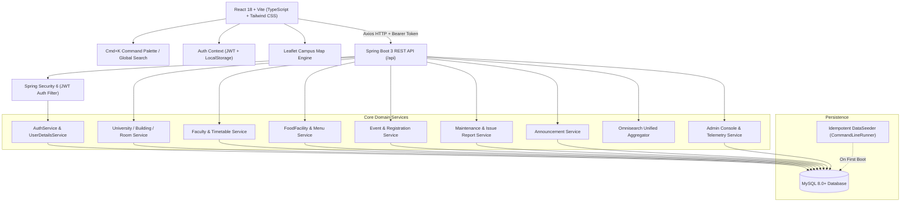

# UniYaar - Smart University Companion Platform

> **Apni Uni. Apna Yaar.** — Your Complete Campus Companion.

UniYaar is an enterprise-grade, modern smart university companion platform built with **Spring Boot 3 (Java 21)**, **MySQL**, **React 18 / Vite (TypeScript)**, **Tailwind CSS**, and **Leaflet Maps**. It unifies fragmented campus data—buildings, indoor room paths, scheduled faculty timetables, daily mess menus, tech hackathons & cultural fests, facility maintenance status & community issue tracking, broadcast circulars, and universal search—into a lightning-fast, cohesive experience.

---

## 🌟 Key Capabilities & Modules

1. **🗺️ Interactive Campus Spatial Map & Navigation**:
   - Leaflet OpenStreetMap integration with custom branded SVG markers.
   - Category filtering (Academics, Dining, Hostels, Sports & SAC, Auditorium).
   - Dynamic walking distance/time estimator and path preview between campus buildings.
   - Full keyboard accessibility and responsive controls.
2. **🏛️ Campus Spatial Hierarchy**:
   - Multi-level structure: University ➔ Departments ➔ Buildings ➔ Floors ➔ Rooms.
   - Room categorization: Lecture Halls, Computing Labs, Faculty Offices, Auditoriums, Seminar Rooms.
3. **👨‍🏫 Faculty Finder & Timetables**:
   - Real-time scheduled location discovery (privacy-first: schedules rather than intrusive GPS tracking).
   - Full weekly schedule grid (Monday–Saturday) with time slots, course names, and room navigation links.
4. **🍽️ Food & Mess Hub**:
   - Live daily breakfast, lunch, snacks, and dinner menus across campus messes and canteens.
   - Dietary badges (`VEG`, `NON_VEG`, `JAIN`) and transparent pricing.
5. **🎉 Events & Hackathons Hub**:
   - Real-time event discovery with category filters (Hackathon, Workshop, Cultural, Sports, Seminar).
   - Live countdowns, capacity indicators, one-click RSVP modal, and venue map routing.
6. **🛠️ Maintenance Status & Student Issue Desk**:
   - Real-time facility outage notices with intelligent alternative route recommendations (e.g. broken elevator ➔ alternative lift / accessibility ramp).
   - Community-driven issue reporting with upvote escalation queue for priority resolution.
7. **📢 Campus Notice Board & Emergency Broadcast**:
   - Priority-tiered announcements (`URGENT`, `IMPORTANT`, `NORMAL`) with real-time ticker bar for emergency weather or campus advisories.
   - Role-targeted filtering (All, Students, Faculty, Staff).
8. **⚡ Omnisearch & Command Palette (`Cmd + K` / `Ctrl + K`)**:
   - Mac Spotlight-style floating command palette searchable from anywhere in the app.
   - Multi-domain instant aggregator querying 7 entity types simultaneously with keyboard navigation.
9. **🛡️ Enterprise Administration & Governance Console**:
   - System telemetry metrics (total users, active notices, open community tickets, event RSVPs).
   - One-click incident triage desk (In Progress / Resolved workflow with technician notes).
   - Broadcast publisher for campus-wide facility outages and emergency announcements.
   - Role governance management (`ROLE_STUDENT`, `ROLE_FACULTY`, `ROLE_STAFF`, `ROLE_ADMIN`).

---

## 🏗️ Architecture Overview



---

## 🐳 Running with Docker Compose (Recommended)

Run the entire platform (MySQL, Spring Boot Backend, and Nginx-powered Frontend) with a single command:

```bash
docker-compose up --build
```

- **Frontend Application**: `http://localhost:3000`
- **Backend API**: `http://localhost:8080/api`
- **Database**: Internal Docker network MySQL instance (with healthcheck and pre-seeded database)

---

## 🚀 Local Development Quick Start

### Prerequisites
- **Java 21** (`openjdk@21`)
- **Maven 3.8+**
- **Node.js 18+** & `npm`
- **MySQL 8.0+** running on port 3306

### 1. Database Setup
Ensure MySQL is running and create the database:
```sql
CREATE DATABASE IF NOT EXISTS uniyaar_db CHARACTER SET utf8mb4 COLLATE utf8mb4_unicode_ci;
```
*(Default settings connect to `localhost:3306/uniyaar_db` with `root` / `password`. Customize in `backend/src/main/resources/application.yml` if needed.)*

### 2. Backend Setup & Startup
```bash
cd backend
export JAVA_HOME=/opt/homebrew/opt/openjdk@21
export PATH="$JAVA_HOME/bin:$PATH"

# Run tests
mvn test

# Start the Spring Boot application
mvn spring-boot:run
```
> **Auto-Seeding**: On first run, `DataSeeder.java` automatically populates the database with buildings, rooms, timetables, mess menus, hackathons, and demo users.

Backend starts on: `http://localhost:8080` (API base: `http://localhost:8080/api`)

### 3. Frontend Setup & Startup
```bash
cd frontend

# Install dependencies
npm install

# Start Vite development server
npm run dev
```
Frontend runs on: `http://localhost:3000`

---

## 🔑 Pre-Seeded Demo Accounts

The system comes pre-loaded with credentials across all roles:

| Role | Email Address | Password | Permissions & Access |
|---|---|---|---|
| **Admin** | `admin@uniyaar.edu` | `Admin@123` | Full Admin Console, Metrics, Incident Resolution, Outage Broadcast, Role Assignment |
| **Staff** | `facilities@uniyaar.edu` | `Staff@123` | Operations Desk, Maintenance Updates, Ticket Triage, Notice Posting |
| **Faculty** | `ramesh.sharma@uniyaar.edu` | `Faculty@123` | Faculty profile, timetable view, office hours, general campus features |
| **Faculty (AI)** | `ananya.gupta@uniyaar.edu` | `Faculty@123` | AI Research profile, sandbox lab schedule, workshops |
| **Student** | `student@uniyaar.edu` | `Student@123` | Issue reporting & upvoting, Event RSVPs, Bookmarking, Omnisearch |

---

## ⌨️ Global Shortcuts

| Shortcut | Action | Description |
|---|---|---|
| `Cmd + K` (Mac) / `Ctrl + K` (Win/Linux) | **Open Omnisearch** | Instant universal spotlight search across all campus entities |
| `↑` / `↓` | **Navigate Results** | Keyboard navigation across search results |
| `Enter` | **Select Item** | Navigate directly to the selected building, room, faculty, or event |
| `Esc` | **Close Palette** | Dismiss search modal |

---

## 📡 REST API Reference

All responses follow the unified response format:
```json
{
  "timestamp": "2026-09-23T12:00:00",
  "success": true,
  "status": 200,
  "message": "Operation successful",
  "data": { ... }
}
```

### Authentication (`/api/auth`)
- `POST /api/auth/register` — Register student or faculty account.
- `POST /api/auth/login` — Authenticate and receive signed JWT token.
- `GET /api/auth/me` — Retrieve current authenticated user profile.

### Campus Spatial Hierarchy & Maps (`/api/buildings`, `/api/departments`, `/api/map`)
- `GET /api/buildings` — List all campus buildings with GPS coordinates and floor counts.
- `GET /api/buildings/{id}` — Get building details including all floors and rooms.
- `GET /api/buildings/{id}/floors/{floorId}/rooms` — List rooms on a specific floor.
- `GET /api/departments` — List academic departments.
- `GET /api/map/markers` — Aggregated coordinates for map overlay (buildings, dining, amenities).

### Faculty & Timetables (`/api/faculty`)
- `GET /api/faculty` — Filter faculty by department, query, or designation.
- `GET /api/faculty/{id}` — Faculty profile and office room location.
- `GET /api/faculty/{id}/timetables` — Weekly scheduled timetable slots.

### Dining & Mess (`/api/food`)
- `GET /api/food/facilities` — List student messes, canteens, and cafes.
- `GET /api/food/facilities/{id}/menu/today` — Daily menu categorized by meal type.

### Events & Hackathons (`/api/events`)
- `GET /api/events` — Discover upcoming and live campus events and hackathons.
- `GET /api/events/{id}` — Event details, venue, and registration counts.
- `POST /api/events/{id}/rsvp` — One-click RSVP registration for authenticated users.

### Maintenance & Community Issue Desk (`/api/maintenance`, `/api/issues`)
- `GET /api/maintenance/active` — Active facility outages with detour recommendations.
- `GET /api/issues` — Community issue reports filtered by status and category.
- `POST /api/issues` — Submit new maintenance issue with building/room details.
- `POST /api/issues/{id}/upvote` — Upvote an existing community issue to escalate priority.

### Announcements & Notices (`/api/announcements`)
- `GET /api/announcements` — List broadcast circulars with priority/audience filters.
- `GET /api/announcements/emergency` — Urgent emergency notices for global banner ticker.

### Global Omnisearch & Bookmarks (`/api/search`, `/api/bookmarks`)
- `GET /api/search?q={query}` — Multi-domain aggregator across all 7 entities.
- `GET /api/bookmarks` — Retrieve user's personal bookmarks.
- `POST /api/bookmarks` — Add entity to personal bookmarks.
- `DELETE /api/bookmarks/{id}` — Remove bookmark.

### Admin Operations Console (`/api/admin`)
- `GET /api/admin/metrics` — Telemetry statistics (active issues, RSVPs, outage count).
- `PUT /api/admin/issues/{id}/status` — Update issue status with resolution notes (`ROLE_STAFF`, `ROLE_ADMIN`).
- `POST /api/admin/maintenance` — Publish new facility outage advisory (`ROLE_STAFF`, `ROLE_ADMIN`).
- `GET /api/admin/users` — List user roster (`ROLE_ADMIN`).
- `PUT /api/admin/users/{id}/role` — Promote or modify user role (`ROLE_ADMIN`).

---

## 📝 License
Built with ❤️ for university students everywhere.  
**UniYaar — Apni Uni. Apna Yaar.**
