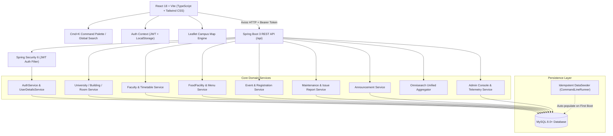

<div align="center">

# 🎓 UniYaar
### *Apni Uni. Apna Yaar.* — The Smart University Companion Platform

[](https://spring.io/projects/spring-boot)
[](https://openjdk.org/)
[](https://reactjs.org/)
[](https://www.typescriptlang.org/)
[](https://vitejs.dev/)
[](https://www.mysql.com/)

<p align="center">
  <b>A unified, high-performance web platform designed to streamline student life, campus navigation, event discovery, dining information, faculty timetables, and administrative governance.</b>
</p>

[✨ Highlights](#-features-at-a-glance) •
[🏗️ Architecture](#️-system-architecture) •
[🚀 Quick Start](#-quick-start) •
[🔑 Demo Accounts](#-pre-seeded-demo-accounts) •
[📡 API Reference](#-rest-api-reference)

---

</div>

## ✨ Features at a Glance

<table>
  <tr>
    <td width="50%" valign="top">
      <h3>🗺️ Campus Spatial Map & Navigation</h3>
      <ul>
        <li>Interactive OpenStreetMap integration powered by Leaflet.</li>
        <li>Point-to-point walking distance & transit time estimator.</li>
        <li>Branded SVG markers with category filters (Hostels, Dining, Academics, Auditoriums).</li>
        <li>Full indoor hierarchy: <i>University → Building → Floor → Room</i>.</li>
      </ul>
    </td>
    <td width="50%" valign="top">
      <h3>👨‍🏫 Faculty Timetables & Finder</h3>
      <ul>
        <li>Privacy-conscious schedule-based location tracking.</li>
        <li>Weekly schedule grid (Mon–Sat) with room navigation shortcuts.</li>
        <li>Department & designation search filters with office room pointers.</li>
      </ul>
    </td>
  </tr>
  <tr>
    <td width="50%" valign="top">
      <h3>🍽️ Food & Mess Hub</h3>
      <ul>
        <li>Live daily menus across campus messes, canteens, and cafes.</li>
        <li>Dietary tags (<code>VEG</code>, <code>NON_VEG</code>, <code>JAIN</code>) with transparent pricing.</li>
        <li>Meal period categorization (Breakfast, Lunch, Snacks, Dinner).</li>
      </ul>
    </td>
    <td width="50%" valign="top">
      <h3>🎉 Events & Hackathons Hub</h3>
      <ul>
        <li>Real-time event discovery with countdown timers & capacity bars.</li>
        <li>1-Click RSVP registration for student attendees.</li>
        <li>Categorized by Hackathon, Cultural, Technical, and Sports.</li>
      </ul>
    </td>
  </tr>
  <tr>
    <td width="50%" valign="top">
      <h3>🛠️ Community Issue Desk & Outages</h3>
      <ul>
        <li>Facility outage notices with detour recommendations (e.g. lift out of service → ramp guidance).</li>
        <li>Community issue reporting with upvote-based priority escalation.</li>
      </ul>
    </td>
    <td width="50%" valign="top">
      <h3>📢 Notices & Emergency Broadcast</h3>
      <ul>
        <li>Priority-tiered notices (<code>URGENT</code>, <code>IMPORTANT</code>, <code>NORMAL</code>).</li>
        <li>Global ticker banner for instant emergency announcements.</li>
        <li>Audience filtering for Students, Faculty, and Staff.</li>
      </ul>
    </td>
  </tr>
  <tr>
    <td width="50%" valign="top">
      <h3>⚡ Omnisearch & Command Palette</h3>
      <ul>
        <li>Spotlight-style Command Palette (<code>Cmd + K</code> or <code>Ctrl + K</code>).</li>
        <li>Unified real-time query across all 7 campus entities simultaneously.</li>
        <li>Full keyboard accessibility with instant shortcuts.</li>
      </ul>
    </td>
    <td width="50%" valign="top">
      <h3>🛡️ Admin & Incident Console</h3>
      <ul>
        <li>Real-time system telemetry and campus analytics.</li>
        <li>One-click maintenance ticket triage workflow.</li>
        <li>Emergency broadcast publisher & role governance.</li>
      </ul>
    </td>
  </tr>
</table>

---

## 🏗️ System Architecture



---

## 🚀 Quick Start for Local Development

### 📋 Prerequisites
- **Java 21** (`openjdk@21`) & **Maven 3.8+**
- **Node.js 18+** & `npm`
- **MySQL 8.0+**

### 1️⃣ Database Setup
Create the MySQL database:
```sql
CREATE DATABASE IF NOT EXISTS uniyaar_db CHARACTER SET utf8mb4 COLLATE utf8mb4_unicode_ci;
```

### 2️⃣ Backend Service
```bash
cd backend

# Compile and run unit tests
mvn test

# Start Spring Boot application
mvn spring-boot:run
```
> 💡 **Tip:** The application automatically runs `DataSeeder.java` on initial startup, seeding realistic campus buildings, rooms, timetables, food menus, events, and sample user profiles.

*Backend runs at `http://localhost:8080` (API base: `http://localhost:8080/api`)*

### 3️⃣ Frontend Client
```bash
cd frontend

# Install dependencies
npm install

# Start Vite dev server
npm run dev
```
*Frontend runs at `http://localhost:3000`*

---

## 🔑 Pre-Seeded Demo Accounts

Test the platform instantly across all user roles:

| Role | Email Address | Password | Permissions & Features |
|:---:|---|:---:|---|
| <span style="color:#ef4444">**Admin**</span> | `admin@uniyaar.edu` | `Admin@123` | Full Admin Console, Metrics, Incident Resolution, Outage Broadcast, Role Governance |
| <span style="color:#f59e0b">**Staff**</span> | `facilities@uniyaar.edu` | `Staff@123` | Operations Desk, Maintenance Updates, Ticket Triage, Notice Posting |
| <span style="color:#3b82f6">**Faculty**</span> | `ramesh.sharma@uniyaar.edu` | `Faculty@123` | Faculty profile, timetable view, office hours, general campus features |
| <span style="color:#8b5cf6">**Faculty (AI)**</span> | `ananya.gupta@uniyaar.edu` | `Faculty@123` | AI Research profile, sandbox lab schedule, workshops |
| <span style="color:#10b981">**Student**</span> | `student@uniyaar.edu` | `Student@123` | Issue reporting & upvoting, Event RSVPs, Bookmarking, Omnisearch |

---

## ⌨️ Keyboard Shortcuts

| Shortcut | Action | Description |
|:---:|---|---|
| <kbd>Cmd</kbd> + <kbd>K</kbd> / <kbd>Ctrl</kbd> + <kbd>K</kbd> | **Open Omnisearch** | Global spotlight search across all campus entities |
| <kbd>↑</kbd> / <kbd>↓</kbd> | **Navigate** | Move through highlighted search results |
| <kbd>Enter</kbd> | **Select** | Navigate directly to the selected building, room, faculty, or event |
| <kbd>Esc</kbd> | **Dismiss** | Close search palette or active modal |

---

## 📡 REST API Reference

All API responses follow the standard JSON envelope:
```json
{
  "timestamp": "2026-09-23T12:00:00",
  "success": true,
  "status": 200,
  "message": "Operation successful",
  "data": { ... }
}
```

<details>
<summary><b>🔐 Authentication (<code>/api/auth</code>)</b></summary>

- `POST /api/auth/register` — Register student or faculty account.
- `POST /api/auth/login` — Authenticate and receive signed JWT token.
- `GET /api/auth/me` — Retrieve current authenticated user profile.
</details>

<details>
<summary><b>🗺️ Campus Spatial Hierarchy & Maps (<code>/api/buildings</code>, <code>/api/map</code>)</b></summary>

- `GET /api/buildings` — List all campus buildings with GPS coordinates.
- `GET /api/buildings/{id}` — Get building details including floors and rooms.
- `GET /api/buildings/{id}/floors/{floorId}/rooms` — List rooms on a specific floor.
- `GET /api/departments` — List academic departments.
- `GET /api/map/markers` — Aggregated coordinates for map overlay.
</details>

<details>
<summary><b>👨‍🏫 Faculty & Timetables (<code>/api/faculty</code>)</b></summary>

- `GET /api/faculty` — Filter faculty by department, query, or designation.
- `GET /api/faculty/{id}` — Faculty profile and office room location.
- `GET /api/faculty/{id}/timetables` — Weekly scheduled timetable slots.
</details>

<details>
<summary><b>🍽️ Dining & Mess (<code>/api/food</code>)</b></summary>

- `GET /api/food/facilities` — List student messes, canteens, and cafes.
- `GET /api/food/facilities/{id}/menu/today` — Daily menu categorized by meal period.
</details>

<details>
<summary><b>🎉 Events & Hackathons (<code>/api/events</code>)</b></summary>

- `GET /api/events` — Discover upcoming campus events and hackathons.
- `GET /api/events/{id}` — Event details, venue, and registration counts.
- `POST /api/events/{id}/rsvp` — One-click RSVP registration for authenticated users.
</details>

<details>
<summary><b>🛠️ Maintenance & Community Issue Desk (<code>/api/maintenance</code>, <code>/api/issues</code>)</b></summary>

- `GET /api/maintenance/active` — Active facility outages with detour recommendations.
- `GET /api/issues` — Community issue reports filtered by status and category.
- `POST /api/issues` — Submit new maintenance issue with building/room details.
- `POST /api/issues/{id}/upvote` — Upvote an existing community issue to escalate priority.
</details>

<details>
<summary><b>📢 Announcements & Notices (<code>/api/announcements</code>)</b></summary>

- `GET /api/announcements` — List broadcast circulars with priority/audience filters.
- `GET /api/announcements/emergency` — Urgent emergency notices for global banner ticker.
</details>

<details>
<summary><b>⚡ Global Omnisearch & Bookmarks (<code>/api/search</code>, <code>/api/bookmarks</code>)</b></summary>

- `GET /api/search?q={query}` — Multi-domain aggregator across all 7 entities.
- `GET /api/bookmarks` — Retrieve user's personal bookmarks.
- `POST /api/bookmarks` — Add entity to personal bookmarks.
- `DELETE /api/bookmarks/{id}` — Remove bookmark.
</details>

<details>
<summary><b>🛡️ Admin Operations Console (<code>/api/admin</code>)</b></summary>

- `GET /api/admin/metrics` — Telemetry statistics (active issues, RSVPs, outage count).
- `PUT /api/admin/issues/{id}/status` — Update issue status with resolution notes (`ROLE_STAFF`, `ROLE_ADMIN`).
- `POST /api/admin/maintenance` — Publish new facility outage advisory (`ROLE_STAFF`, `ROLE_ADMIN`).
- `GET /api/admin/users` — List user roster (`ROLE_ADMIN`).
- `PUT /api/admin/users/{id}/role` — Promote or modify user role (`ROLE_ADMIN`).
</details>

---

<div align="center">

Built with ❤️ for university students everywhere.  
**UniYaar — Apni Uni. Apna Yaar.**

</div>
